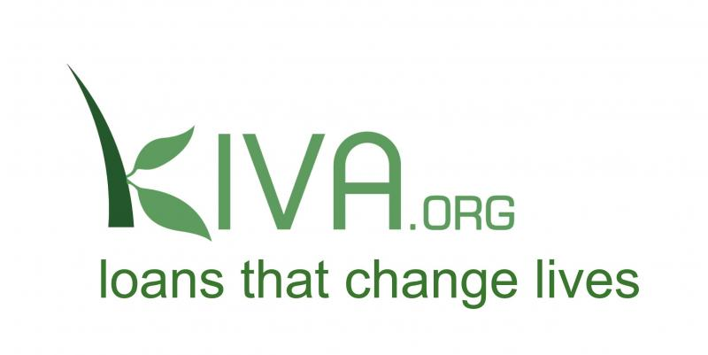

```{r setup, include=FALSE}
knitr::opts_chunk$set(echo = TRUE)
```



## 1. Explanation {.tabset .tabset-fade .tabset-pills}

### 1.1 brief

"hi welcome to my Rmd :)
in this LBB i will use previous data which is loan_kiva.csv"

### 1.2 Data's Point of View
Kiva.org is a non-profit online crowdfunding platform that allows individuals to borrow funds for business purposes. Its mission is to improve the welfare of marginalized citizens (especially low-income entrepreneurs and students) in several countries. Crowdfunding (crowdfunding) is the activity of funds from several individuals to finance new business ventures.

Note : Detail explanatory will be given ata the of content


## 2. Input Data

```{r}
loan_kiva =read.csv("loan_kiva.csv")
```

##2.1 Data Inspection

```{r}
head(loan_kiva)
tail(loan_kiva)
names(loan_kiva)
```

From out inspection we can conclude : 
*loan kiva data contain 323279 rows and 14 coloumns
* each of coloumn :
id                : Unique ID for (loan ID)
funded_amount     : the amount disbursed by Kiva to the agent (USD)
loan_amount       : Amount distributed by agents to borrowers (USD)
activity          : A more specific category than sectors
sector            : Category of loan
country           : The full country name, where the loan is disbursed
region            : The full region name of the country
currency          : Currency
partner_id        : ID for the partner organization
posted_time       : Loan time is posted on Kiva by an agent
funded_time       : The time the loan has been fully financed by the lender
term_in_months    : Duration of loan disbursement (in months)
lender_count      : The number of borrowers who contributed
repayment_interval: How to pay off the loan

##2.2 Data Cleansing & Coertions
check data type for each colomn
```{r}
str(loan_kiva)

```
for this result , we find some of data type not in the correct type, we need to convert it into corect type (data coertion)

```{r}
loan_kiva[,c("activity","sector","country","region","currency","repayment_interval")] =lapply(loan_kiva[,c("activity","sector","country","region","currency","repayment_interval")],as.factor)

loan_kiva$posted_time <- as.Date(loan_kiva$posted_time,"%Y-%m-%d %H:%M:%S")
loan_kiva$funded_time <- as.Date(loan_kiva$funded_time,"%Y-%m-%d %H:%M:%S")


str(loan_kiva)
```

Each of colomn already changed ito desired data type

cek for missing value
```{r}
colSums(is.na(loan_kiva))
```
```{r}
anyNA(loan_kiva)
```

Great! No missing value

## 3. Data Eplanation
Brief explantaion
```{r}
summary(loan_kiva)
```
Summary :

1.First loan occured in january,1 2014
2.Farming was the most popular for Activity 
3.Agriculture was the most popular sector for loan 
4.Philipin was the most country loan amount
5.Kiva Loan gained funded amount average at 828,8 USD ; with max funded amount at 100000 USD
6. mean of lender count at 22.85 human ; with max lender count is 2896 human
7. the mos popular of repayment interval is monthly
8. mean of term in months is 13.9 with max term in month is 158

